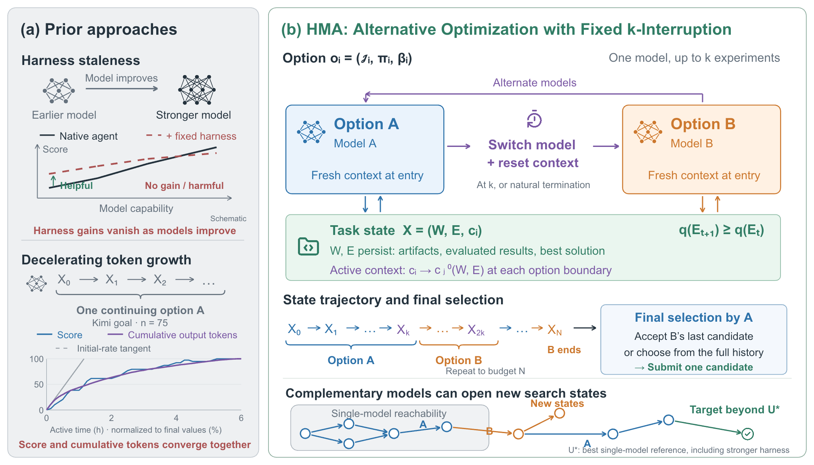

# Humanize MLE Agents: Multi-Agent Session Alternation Beyond Single-Agent Limits

This repository provides the experiment code for **Humanize MLE Agents (HMA)**.
HMA alternates two native coding agents over a shared machine-learning workspace,
so each agent can build on the other's code, models, and candidate solutions.

## Abstract

Long-running machine-learning agents can make progressively slower improvements,
while the benefits of specialized harnesses can change as their underlying models
improve. HMA addresses these limitations through coordination across agent
sessions. Two agents alternate over a shared workspace, starting with a fresh
context at each handoff and a fixed experiment budget per session. The method
preserves each agent's native tools and execution loop without adding
task-specific prior knowledge. The paper develops a context-reset semi-Markov
model of this process and evaluates the workflow on 75 MLE-bench tasks.

## Table of Contents

- [HMA](#hma)
  - [Results summary](#results-summary)
  - [Figure 1: HMA overview](#figure-1-hma-overview)
  - [Main results](#main-results)
  - [How it works](#how-it-works)
- [Installation](#installation)
- [Reproducing the Experiments](#reproducing-the-experiments)
- [Dataset and Models](#dataset-and-models)
- [Citation](#citation)
- [Acknowledgments](#acknowledgments)

## HMA

### Results summary

HMA alternates native coding agents over a shared machine-learning workspace. On
75 MLE-bench tasks under a matched six-hour budget, the strongest configuration
(Opus 5 ↔ GPT-5.6-sol) reaches **78.2% any-medal rate**, **53.8% gold rate**, and
**90.7% above the human median**. It improves over the mean of its two constituent
single-agent baselines by **8.0 percentage points** in any-medal rate and **5.9
points** in mean leaderboard percentile.

Across the six evaluated HMA pairings, HMA improves over the corresponding mean
single-agent baseline by an average of **6.4 percentage points** in any-medal rate.
The table below reports the main manuscript results; all values are percentages.

### Figure 1: HMA overview



HMA combines context renewal with complementary agent capabilities. Each option
runs a native agent for at most *k* accepted experiments (or until natural
termination), then hands off the shared workspace to the other agent with a fresh
context. Artifacts, evaluated results, and candidate solutions persist across the
handoff, and the final reviewer selects one already accepted candidate.

### Main results

The table keeps the headline comparisons from the paper. All values are
percentages; the full set of model-pair ablations is reported in the paper.

| Workflow | Time (h) | All (75) | Gold | Med+ | Mean percentile |
|---|---:|---:|---:|---:|---:|
| Claude Opus 5 (`/goal`) | 6 | 72.4 | 50.7 | 85.3 | 84.8 |
| GPT-5.6-sol (`/goal`) | 6 | 68.0 | 47.6 | 81.3 | 81.3 |
| ScienceFlow | 24 | 70.2 | — | — | — |
| MLEvolve | 12 | 65.3 | 34.7 | 76.0 | — |
| **HMA: Opus 5 ↔ GPT-5.6-sol** | **6** | **78.2** | **53.8** | **90.7** | **89.0** |
| HMA: GPT-5.6-sol ↔ Opus 5 | 6 | 73.3 | 50.7 | 85.3 | 85.4 |
| HMA: GPT-5.6-sol ↔ DeepSeek V4.1 Flash | 6 | 72.0 | 50.7 | 85.3 | 84.4 |
| HMA: GPT-5.6-sol ↔ Kimi K3 | 6 | 70.7 | 50.7 | 85.3 | 83.9 |

“ All” is the any-medal rate over all 75 tasks. “Gold” is the gold-medal rate,
“Med+” is the fraction above the human leaderboard median, and “Mean percentile”
averages task-level leaderboard percentiles. HMA starts with the first listed
model and uses the same six-hour budget as the native baselines.

### How it works

1. The first agent explores the task and submits candidate solutions.
2. After at most **5 accepted submissions**, or natural completion, the next
   agent starts a fresh session in the same workspace.
3. The agents alternate within a **six-hour task budget**.
4. The final **15 minutes** are reserved for reviewing and selecting an already
   accepted candidate. Private test scores remain hidden from the agents.

The reproduction suite includes native goal baselines, HMA, natural-termination
alternation (NTA), cap and starting-order ablations, and external harness
comparisons. See the [experiment map](docs/experiments.md) for the correspondence
to the paper's tables and figures.

## Installation

Clone the repository and install the Python dependencies:

```bash
git clone https://github.com/humanfia/humanize-mle-agents.git
cd humanize-mle-agents
python3.12 -m venv .venv
source .venv/bin/activate
pip install -r requirements-repro.lock
pip install --no-deps -e .
```

Run the commands below from the repository root with this environment active.

## Reproducing the Experiments

### Data and environment

Download and prepare the **75 MLE-bench datasets**, with Kaggle access and the
competition rules accepted. The [data preparation guide](docs/local-run.md#5-prepare-and-verify-data)
provides the download and preparation steps used by this repository.

The paper allocates **1 NVIDIA A10, 30 vCPUs, and 220 GiB RAM per task**.
For the full suite, we recommend **75 A10 machines managed by Docker Swarm**,
with one benchmark task assigned to each machine. That machine runs the task's
configurations and repeats sequentially. Follow the [cluster setup guide](docs/swarm.md)
to prepare the machines, Docker environments, and experiment data.

### API configuration

Edit the included [`configs/local.json`](configs/local.json) directly with your
data directory and provider credentials. API keys and base URLs are left blank
in the repository.

| Setting | What to enter |
| --- | --- |
| `data_root` | Directory containing the prepared task data; the cluster guide uses `/srv/hma/data` |
| `providers.<provider>.api_key` | Your API key for that provider |
| `providers.<provider>.base_url` | The API endpoint for that provider |

The provider names are `openai`, `anthropic`, `glm`, `deepseek`, and `kimi`.
For example, fill the existing `providers.openai` entry as follows; the empty
strings below are placeholders for your own values:

```json
{
  "api_key": "",
  "base_url": ""
}
```

Model IDs, agent order, budgets, and repeat counts are already defined in
[`experiments.json`](src/hma/repro/assets/experiments.json).

### Run one experiment

We use **Opus→GPT HMA on leaf-classification** as a running example. After preparing
the task data and Docker images using the [single-machine guide](docs/local-run.md),
run one repeat:

```bash
python -m hma.repro.cli run \
  --config configs/local.json \
  --experiment hma-opus-gpt --task leaf-classification --repeat 0 \
  --run-root runs/hma-example
```

This uses the full six-hour task budget. Change `--experiment` and `--task` to
select another configuration or benchmark. The [experiment map](docs/experiments.md)
lists the available groups; the local guide also includes shorter smoke checks.

### Run the full suite on 75 machines

Complete the [Swarm setup](docs/swarm.md) first. That guide publishes the Docker
images, creates `configs/swarm.local.json`, freezes the task-to-node assignments,
and prepares each node to run them. Then launch from the manager:

```bash
python -m hma.repro.swarm deploy \
  --root /srv/hma/runs/paper \
  --config configs/swarm.local.json --docker-gid DOCKER_GID
```

Replace `DOCKER_GID` with the value established during cluster setup. The full
plan contains **27 configurations and 3,397 task-runs**. Monitoring and recovery
commands are included in the setup guide; started attempts are never silently
retried.

### Generate tables and figures

For the single-experiment example:

```bash
python -m hma.repro.cli report \
  --run-root runs/hma-example --output outputs/hma-example
```

For the full Swarm campaign, collect the completed task shards and generate the
paper reports:

```bash
python -m hma.repro.swarm collect \
  --root /srv/hma/runs/paper --output /srv/hma/runs/paper-report
python -m hma.repro.cli report \
  --run-root /srv/hma/runs/paper-report --output outputs/rerun
```

Reports contain CSV tables, PDF/SVG/PNG figures, and a `coverage.json` file showing
whether the required evidence is complete. Use `--allow-partial` with `report`
to inspect incomplete runs. A selected experiment produces a subset report, not
full-paper coverage.

## Dataset and Models

The benchmark contains **75 MLE-bench tasks**: 22 low-, 38 medium-, and 15
high-complexity tasks. The external-harness comparison uses a fixed
[16-task subset](src/hma/repro/assets/tasks-16.json) of these tasks.

| Model | Model ID | Native harness |
| --- | --- | --- |
| Claude Opus 5 | `claude-opus-5` | Claude Code |
| GPT-5.6-sol | `gpt-5.6-sol` | Codex |
| GLM-5.3 | `glm-5.3` | Claude Code |
| DeepSeek-V4-Flash | `deepseek-v4-flash` | DeepSeek Harness |
| DeepSeek-V4.1-Flash | `deepseek-v4.1-flash` | DeepSeek Harness |
| Kimi K3 | `kimi-k3` | Kimi Code |

All native agents use `max` reasoning effort.

The external baselines are ML-Master 2.0, MLEvolve, and ScienceFlow. Source revisions
and environment details are recorded in [provenance](docs/provenance.md).

This rerun setup currently uses public upstream answer keys; the manuscript's
corrected-key patch has not been incorporated. Actual Docker/GPU/API and
multi-node execution remain unvalidated here. See the [validation record](docs/verification.md)
for the completed checks and remaining limitations. [AGENTS.md](AGENTS.md) provides
the maintenance and execution runbook.

## Citation

The arXiv link and citation will be added with the paper release.

## Acknowledgments

This repository builds on [MLE-bench](https://github.com/openai/mle-bench),
[EvoMaster / ML-Master 2.0](https://github.com/sjtu-sai-agents/EvoMaster),
[MLEvolve](https://github.com/InternScience/MLEvolve), and
[ScienceFlow](https://github.com/science-learner/ScienceFlow).
We thank their authors for releasing the code and benchmark resources.
